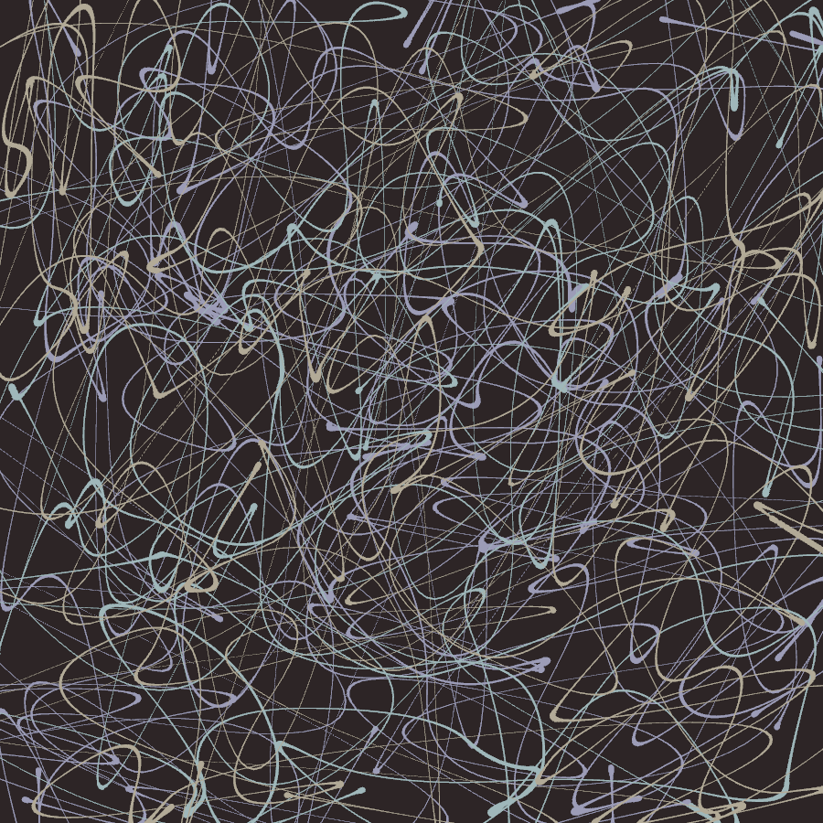
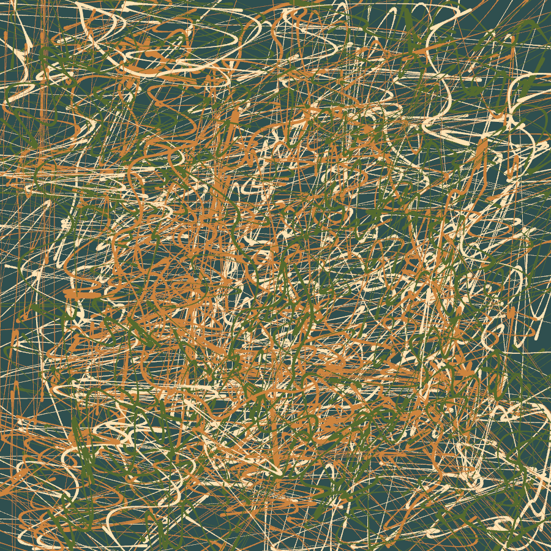
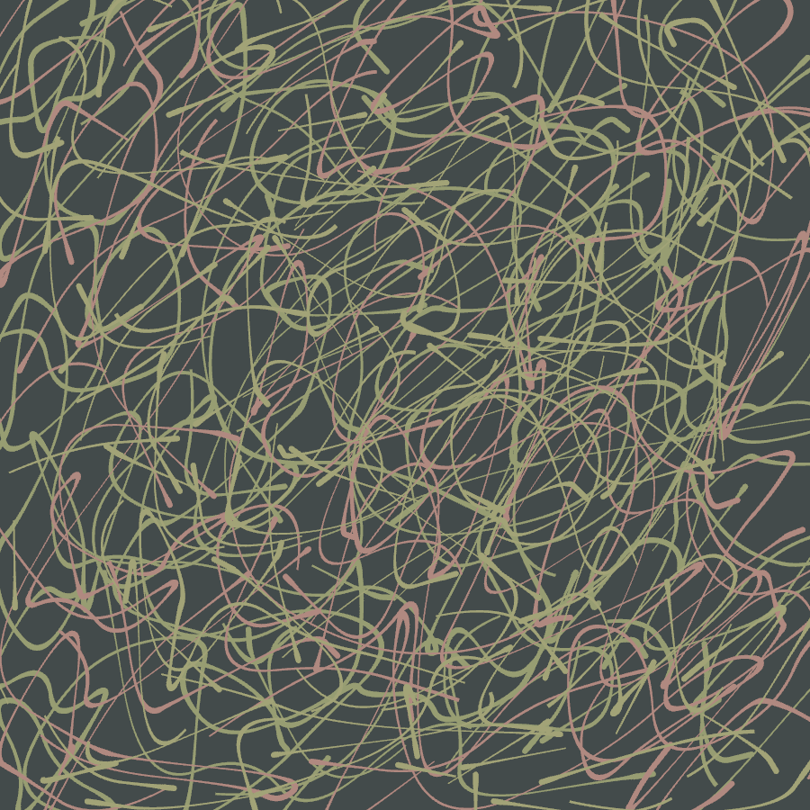
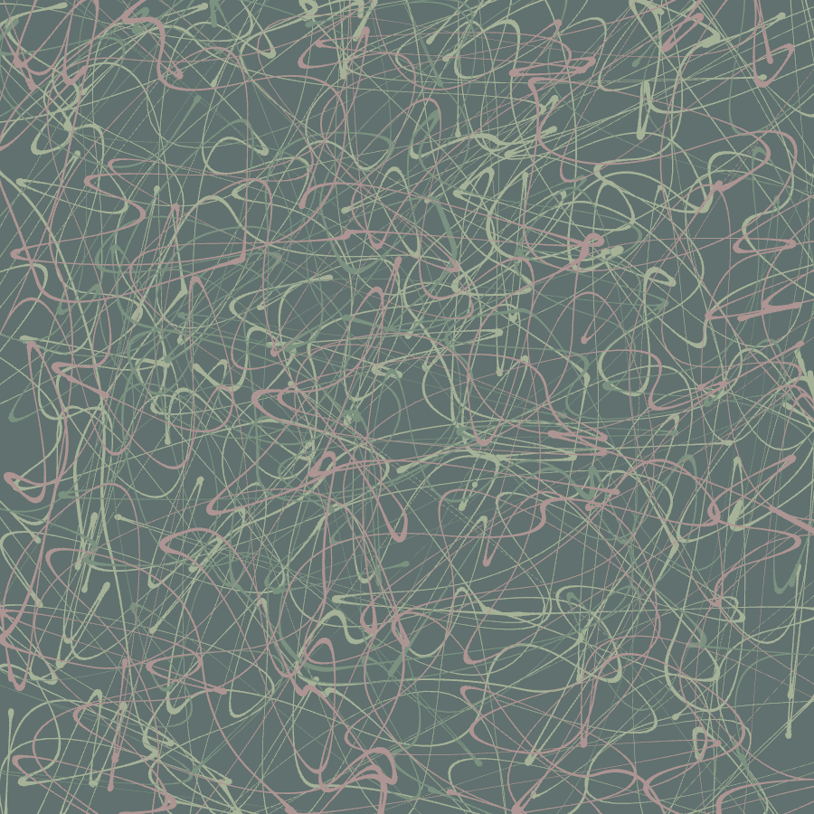
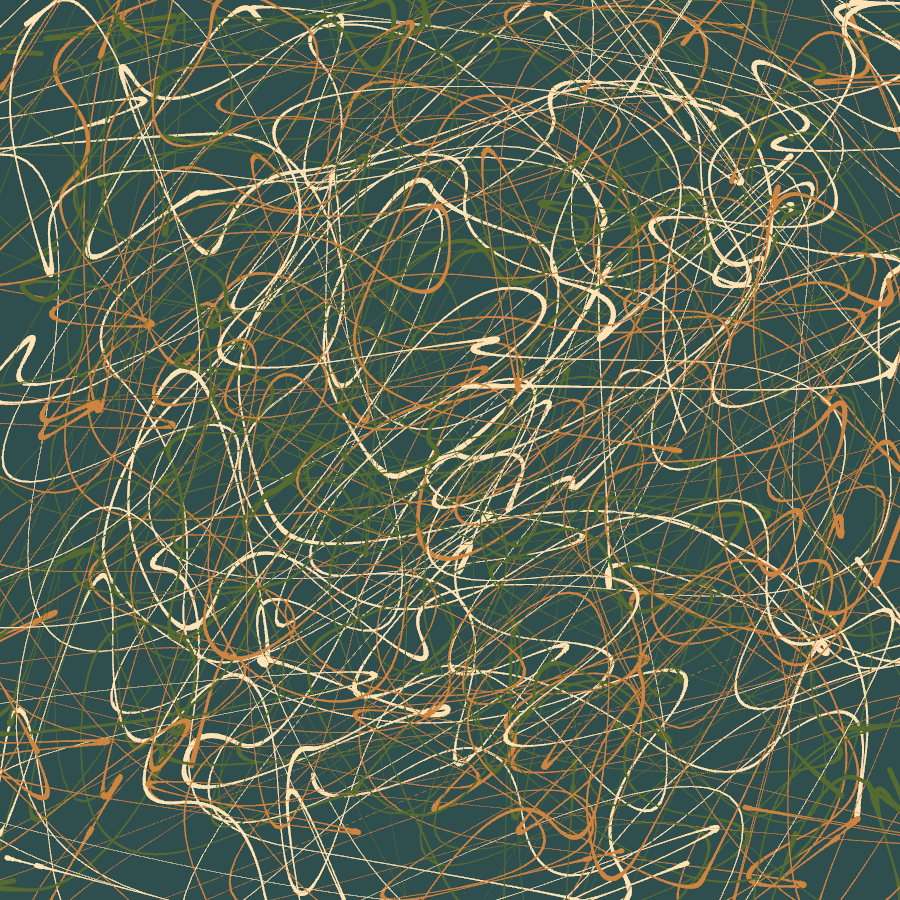

# Intwerp
A cool little interpolation toy in Rust. This was meant as an experiment in reconstructing the path taken by a user's mouse with limited data. The method I tested here was interpolating using quadratic Bezier curves between every two mouse samples, in such a way that the direction and speed of the curve is continuous. What I discovered was that this is not super effective for recreating an authentic human-looking mouse trail, but it's super fun to play with and makes some cool looking images.

If anyone is interested in playing with this, it should be super straight forward to build with the standard Rust tools. Be warned however that Nannou requires some extra dependencies on Linux. (I can't speak to the situation on Mac and Windows.)

